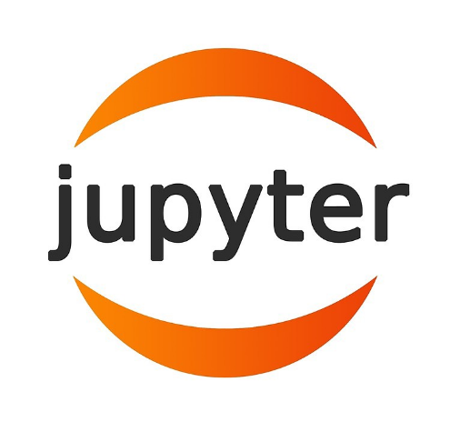

<h2 align="left">Hey👋, I'm Mayank</h2>
<!--Intro Section-->

&nbsp;&nbsp;&nbsp;&nbsp;&nbsp;&nbsp;&nbsp;&nbsp;B.tech Computer Science which specialize in Artificial Intelligence at Parul University 
&nbsp;&nbsp;&nbsp;&nbsp;&nbsp;&nbsp;&nbsp;&nbsp;Interested in Artificial Intelligence & Software Development. 
&nbsp;&nbsp;&nbsp;&nbsp;&nbsp;&nbsp;&nbsp;&nbsp;When I'm not coding, I'm playing football! 🥅 
&nbsp;&nbsp;&nbsp;&nbsp;&nbsp;&nbsp;&nbsp;&nbsp;If you're a fan of Cristiano Ronaldo, we are already friends. ¡Siuuu! ⚽️❤️ 
&nbsp;&nbsp;&nbsp;&nbsp;&nbsp;&nbsp;&nbsp;&nbsp;Here's more about my work experience[(Resume)](https://drive.google.com/file/d/1UmHL0uaPpT7LAQo9vy-u4cyZguZPxZLC/view?usp=sharing)   

<!--Skills Section-->
## My Tech Stack

	<h4> Programming Lanauges</h4>

	&nbsp;
	&nbsp;
	&nbsp;
	&nbsp;
	&nbsp;
	&nbsp;
	&nbsp;
	&nbsp;
	&nbsp;
	&nbsp;

	<h4> Frameworks</h4>

	&nbsp;
	&nbsp;	
	&nbsp;
	&nbsp;
	&nbsp;
	&nbsp;
	&nbsp;
	&nbsp;
<!-- 	&nbsp;
 -->
    <h4>Software Packages</h4>

	&nbsp;
	&nbsp;
	&nbsp;
	&nbsp;

 
<!--Connect Section-->

<i>Let's connect and chat! Open to anything under the sun.</i> 

	&nbsp;&nbsp;&nbsp;&nbsp;&nbsp;&nbsp;&nbsp;&nbsp;&nbsp;&nbsp;&nbsp;&nbsp;&nbsp;&nbsp;&nbsp;&nbsp;&nbsp;&nbsp;
	
	<a href="mailto:mayankmaik6@gmail.com">
		&nbsp;&nbsp;
	</a>
	<a href="https://instagram.com/_maik_0121">
		&nbsp;&nbsp;
	</a>
	
<!--  -->

  

<!-- Profile Views -->

<table>
  <tr>
    <td>
      
    </td>
    <td>
      
    </td>
  </tr>
  <tr>
    <td>
      
    </td>
  </tr>
</table>

**[Visit my website &rarr;](#)**
